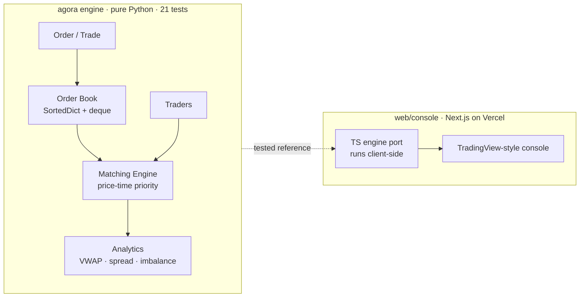

# Project Agora

**A decision-intelligence system for market microstructure.**
Not a trading bot and not a price predictor — a working model of the machinery *inside* an exchange (a limit order book, a price-time-priority matching engine, a population of simulated traders, an analytics layer) wrapped in a tool that answers **"what happens if I do X?" before you commit to X.** Prices are never set; they **emerge** from order flow — and you can *fork the market*, intervene on one branch, and get a decision report telling you what changed, why, and whether to do it.

### ▶ Live console — **https://console-ecru-omega.vercel.app**

*Strict-black TradingView-style console: live candles, order-book depth, time & sales, analytics, a manual order ticket, and a live trader-mix editor — all running a real matching engine in your browser.*

<!-- HIGH-VALUE TODO: record a ~10s screen capture of the live console (market ticking,
     order book updating), export as docs/demo.gif, and uncomment:
 -->

---

## Why this exists

Most "quant" student projects predict prices. This one asks a more fundamental question: **where does a price even come from?** The answer — matching engines, order books, liquidity, and the interaction of different traders — is the actual subject of market microstructure, and the thing proprietary trading firms care about. Agora builds that machinery from scratch so the mechanics are understood, not black-boxed.

## What it does

- **Limit order book** with bid/ask sides, price levels, and market depth.
- **Matching engine** enforcing **price-time priority** — full & partial fills, order cancel, cancel-replace modify, and stop / stop-limit triggers with cascading.
- **Order types:** market, limit, stop, stop-limit · **time-in-force:** GTC, IOC, FOK.
- **Simulated traders:** market maker (with inventory skew), momentum, mean-reversion, noise, aggressive institutional, passive — the market self-organises from their interaction.
- **Analytics:** VWAP, bid-ask spread, order imbalance, realized volatility, market depth, trade frequency.
- **Queue position & latency:** every order carries a latency (fast market makers reach the book first); orders arrive in latency order, and the console shows **exactly where your resting order sits in the FIFO queue** — lots ahead, yours, behind — the quantity that actually governs fill probability and adverse selection.
- **Multi-asset:** four independent instruments (index, large-cap, small-cap, ETF), each with its own book — a small-cap is genuinely ~15× more volatile than the index.
- **Interactive console:** send your own orders and see the slippage, watch your queue position, edit the trader mix live, trigger scenario presets (Calm / Flash Crash / Liquidity Crisis).
- **Scenario Lab (decision intelligence):** *fork the market* — build a control and a treatment timeline from an identical seed, apply one intervention to the treatment (pull the market makers, inject a 400-lot sweep, unleash a momentum crowd…), run both forward across 8 seeds, and get a **decision report**: verdict, a causal chain (*makers removed → spread widens 57% → volatility rises 218%*), a measured-effect table with per-metric consistency, trade-offs, and a confidence grounded in how often the direction held. Answers all four decision questions — *what's happening · why · what if I intervene · should I* — with a persisted decision journal.

## Performance

The matching engine sustains **~95,000 orders/sec single-threaded in pure CPython** on a realistic limit/market/cancel mix (no C extensions, no batching):

```bash
cd engine && python -m agora.benchmark 200000
```


## Architecture



**Engine / UI separation is deliberate.** The engine is a pure, dependency-free module with its own test suite — it can be verified without rendering a pixel. The deployed console runs a faithful TypeScript **port** of it client-side (so the demo needs no backend and deploys as static files); the Python engine remains the tested source of truth. Rationale: [`vault/20-decisions/`](vault/20-decisions).

## Engineering highlights (the interview-defensible parts)

- **Integer-tick arithmetic.** Prices are stored as integer ticks, never floats — off-grid prices are *rejected*, and price-level equality is exact. Floats keying an order book is a latent bug; this design forecloses it.
- **Data structures with intent.** `SortedDict` of price → level gives O(log n) level maintenance and O(1) best-of-book; a `deque` per level encodes time priority as FIFO. Complexity is a design choice, not an accident.
- **Price-time priority, correctly.** Best price first; ties by arrival order. `modify` is cancel-replace and *loses* time priority — matching real exchange semantics.
- **Instrument-agnostic engine.** Multi-asset required **zero** changes to the matcher — just N engines and a router, exactly as real venues work.
- **Queue position & latency.** Orders carry a latency and arrive in latency order; a `queue_position` primitive exposes lots-ahead / rank at a price level — the real driver of fill probability that market-making desks optimise for.
- **Tested.** 26 `pytest` cases cover market-impact walks, partial fills, IOC/FOK, cancel/modify, stop cascades, and queue-position accounting.

## Run it

**Engine + tests (Python):**
```bash
python -m venv .venv && source .venv/bin/activate
pip install -r requirements.txt
pytest                                   # 21 tests
cd engine && python -m agora.simulation  # ~1000 emergent trades + analytics summary
```

**Console (Next.js):**
```bash
cd web/console && npm install && npm run dev   # http://localhost:3737
```

## Project structure

```
engine/agora/   pure-Python engine — instrument, orders, book, matching, traders, analytics
tests/          pytest (engine-first)
web/console/    Next.js console + client-side TS engine port (deploys to Vercel)
vault/          full knowledge base: concepts, decisions, glossary, milestones, references
```

## Documentation / study vault

Every concept, decision, and milestone is written up in [`vault/`](vault) (Obsidian-compatible). Start at [`vault/00-index/Home.md`](vault/00-index/Home.md). The [engine architecture guide](vault/30-guides/Engine-Architecture.md) is the best code-alongside read.

## Built with

Python · `sortedcontainers` · pytest · TypeScript · Next.js · Vercel.
